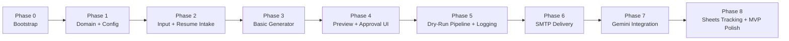

# Phase-Wise Implementation Plan: The Closer

This plan reflects the updated product direction: instead of only using static sample contacts, the app will help a user create a personalized outreach email from a job description, job link or job ID, resume content, and recipient details. The user will review the draft and then choose to send, draft, or skip.

The build order below is designed for a real-world, step-by-step implementation in Cursor.

---

## Principles

- Build one working slice at a time.
- Keep the first version safe and human-controlled.
- Make each phase verifiable with a command or a visible output.
- Do not move to the next phase until the current one works.

---

## Updated Phase Map

| Phase | Focus | Outcome |
|-------|--------|---------|
| 0 | Bootstrap | Project runs locally |
| 1 | Domain + config | Strong data structures and config loading |
| 2 | Resume + input | Job description, resume text, and recipient data can be captured |
| 3 | Basic generator | A clean cold email draft is produced |
| 4 | Preview + approval | User can review and choose send / draft / skip |
| 5 | Dry-run pipeline + logging | Full loop works without sending anything real |
| 6 | SMTP delivery | Emails can be sent or drafted through email provider |
| 7 | Gemini integration | AI-generated subject and body become the main flow |
| 8 | Sheets tracking + polish | Outreach records are stored and the app feels production-ready |

---

## Phase 0: Project Bootstrap

Goal: Create a clean, runnable base project.

### Tasks

- [ ] Create the folder structure under `src/closer/`
- [ ] Add `requirements.txt` and `requirements-dev.txt`
- [ ] Add `.gitignore` for `.env`, `.venv`, caches, and logs if needed
- [ ] Add `.env.example` with placeholder values
- [ ] Create `main.py`, `streamlit_app.py`, `data/`, and `logs/`
- [ ] Make sure the app starts locally without errors

### Exit criteria

- Running `python main.py` or `streamlit run streamlit_app.py` starts the project.

---

## Phase 1: Domain Models + Configuration

Goal: Define the core data structures and config loading.

### Tasks

- [ ] Create models for:
  - `Contact`
  - `EmailDraft`
  - `OutreachRecord`
  - `DeliveryResult`
- [ ] Build config loading from `.env`
- [ ] Add variables for:
  - `SMTP_HOST`
  - `SMTP_PORT`
  - `SMTP_USER`
  - `SMTP_PASSWORD`
  - `SENDER_NAME`
  - `DRY_RUN`
  - `SEND_MODE`
  - `MAX_OUTREACH_PER_RUN`
  - `GEMINI_API_KEY` (later)

### Exit criteria

- The app can load configuration and create typed objects for downstream phases.

---

## Phase 2: Input + Resume Intake

Goal: Capture the information needed to generate a useful outreach email.

### Tasks

- [ ] Add a form or input structure for:
  - recipient email
  - company name
  - role / job title
  - job description
  - job link or job ID
  - resume text or uploaded resume content
  - optional personalization note
- [ ] Support both manual text input and file upload later
- [ ] Validate required fields before generation

### Exit criteria

- The user can enter the job context and resume information without errors.

---

## Phase 3: Basic Email Generator

Goal: Produce a professional cold email draft from the collected information.

### Tasks

- [ ] Build a deterministic template generator first
- [ ] Create subject and body from:
  - company name
  - role
  - job description summary
  - resume context
  - personalization note
- [ ] Keep the body short, professional, and under a reasonable length
- [ ] Make sure the draft is human-readable and not overly generic

### Exit criteria

- The app can generate one polished draft from one job input.

---

## Phase 4: Preview + Approval UI

Goal: Let the user review the generated email before taking action.

### Tasks

- [ ] Add a preview section that shows:
  - subject
  - body
  - company
  - role
  - recipient email
- [ ] Add action buttons for:
  - send
  - draft
  - skip
- [ ] Keep the human approval step mandatory

### Exit criteria

- The user can preview the generated email and choose what to do next.

---

## Phase 5: Dry-Run Pipeline + Logging

Goal: Make the whole flow work end-to-end without sending real email yet.

### Tasks

- [ ] Connect the input → generation → preview → action flow
- [ ] Add dry-run behavior for safe testing
- [ ] Save each attempt in a local log file
- [ ] Capture status values like:
  - generated
  - drafted
  - sent
  - skipped
  - failed

### Exit criteria

- The full workflow runs successfully in safe mode with logging enabled.

---

## Phase 6: SMTP Delivery

Goal: Enable real sending or drafting through email.

### Tasks

- [ ] Connect SMTP delivery for real sends
- [ ] Keep `DRY_RUN=true` by default
- [ ] Support send and draft actions clearly
- [ ] Show user-friendly error messages if SMTP fails

### Exit criteria

- One real email can be sent or drafted from the app after user confirmation.

---

## Phase 7: Gemini Integration

Goal: Replace the basic template with AI-generated outreach content.

### Tasks

- [ ] Add Gemini API integration
- [ ] Pass job description, company, role, and resume context to the model
- [ ] Generate:
  - subject line
  - short professional email body
- [ ] Keep the output within a safe and short format
- [ ] Maintain the preview-and-approve step

### Exit criteria

- The app produces AI-generated outreach drafts from resume + job context.

---

## Phase 8: Google Sheets Tracking + MVP Polish

Goal: Turn the project into something useful for regular everyday use.

### Tasks

- [ ] Create a Google Sheets integration for outreach tracking
- [ ] Store rows with columns like:
  - date and time
  - recipient email
  - company
  - role
  - job link or job ID
  - subject line
  - status
- [ ] Update the status later as:
  - sent
  - awaiting reply
  - replied
  - no reply
- [ ] Improve the UI and README for recruiters and evaluators
- [ ] Prepare a clean demo flow and submission artifacts

### Exit criteria

- Each outreach action is logged and visible in Google Sheets.
- The app looks polished enough to present as a real tool.

---

## Stretch Ideas

After the MVP is stable, we can add:

- follow-up email generation,
- resume parsing from uploaded PDF/DOCX,
- richer analytics,
- auto-status updates from email replies,
- authentication and multiple users,
- deployment to a hosted web platform.

---

## Suggested Build Sequence

1. Build the local workflow first.
2. Make sure the UI and logic are reliable.
3. Add SMTP delivery.
4. Add Gemini-generated drafts.
5. Add Google Sheets tracking.

This keeps the project practical and avoids building too much at once.
